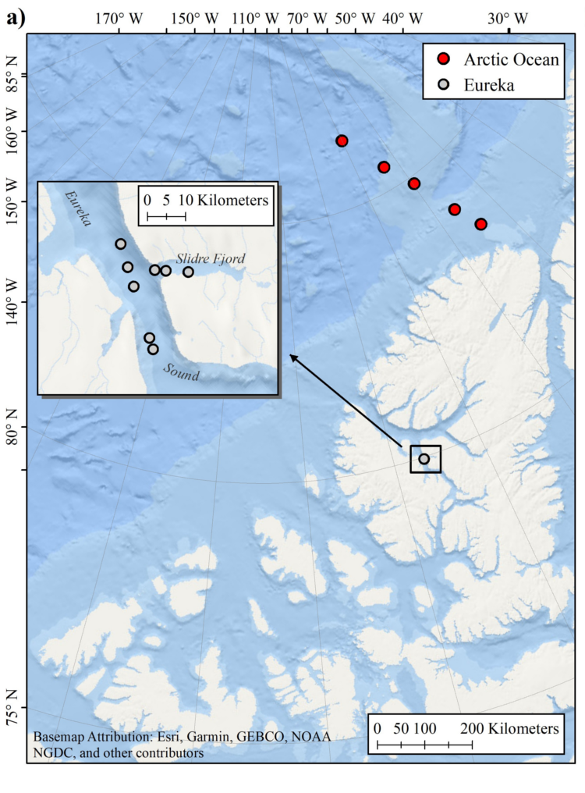
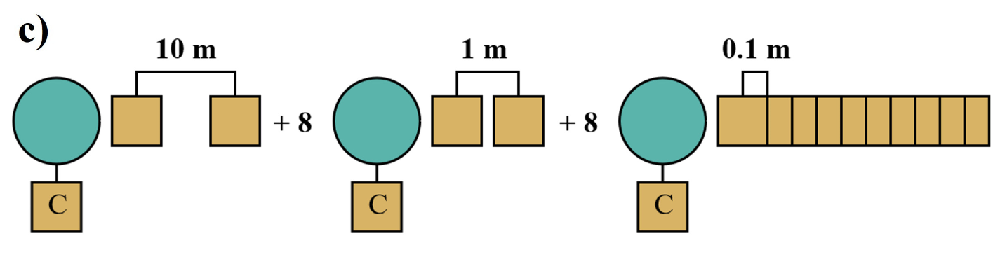

# SMP-Sea-Ice


This repository contains algorithms, datasets, and techniques referenced in following publication and digital object identifier:

> King, J., Howell, S., Brady, M., Toose, P., Derksen, C., Haas, C., and Beckers, J.: <b>Local-scale variability of snow density on Arctic sea ice</b>, The Cryosphere Discuss., https://doi.org/10.5194/tc-2019-305, in review, 2020.

> [](https://doi.org/10.5281/zenodo.4068349)


## Abstract
Local-scale variations in snow density and layering on Arctic sea ice were characterized using a combination of traditional snow pit and SnowMicroPen (SMP) measurements. In total, 14 sites were evaluated within the Canadian Arctic Archipelago and Arctic Ocean on both first (FYI) and multi-year (MYI) sea ice. Sites contained multiple snow pits with coincident SMP profiles as well as unidirectional SMP transects. An existing SMP density model was recalibrated using manual density cutter measurements (n=186) to identify best-fit parameters for the observed conditions. Cross-validation of the revised SMP model showed errors comparable to the expected baseline for manual density measurements (RMSE=34 kg m<sup>-3</sup> or 10.9%) and strong retrieval skill (R<sup>2</sup>=0.78). The density model was then applied to SMP transect measurements to characterize variations at spatial scales of up to 100 m. A supervised classification trained on snow pit stratigraphy allowed separation of the SMP density estimates by layer-type. The resulting dataset contains 58,882 layer-classified estimates of snow density on sea ice representing 147 m of vertical variation and equivalent to more than 600 individual snow pits. An average bulk density of 310 kg m<sup>-3</sup> was estimated with clear separation between FYI and MYI environments. Lower densities on MYI (277 kg m<sup>-3</sup>) corresponded with increased depth hoar composition (49.2%), in strong contrast to composition of the thin FYI snowpack (19.8%). Spatial auto-correlation analysis showed layered composition on FYI snowpack to persist over long distances while composition on MYI rapidly decorrelated at distances less than 16 m. Application of the SMP profiles to determine propagation bias in radar altimetry showed the potential errors of 0.5 cm when climatology is used over known snow density.



#### Figure 1a: Overview of the Eureka and Arctic Ocean (AO) snow on sea ice campaigns.



#### Figure 1c: Unidirectional SnowMicoPen (SMP) transects were collected at multiple sites to evaluate spatial variability of snowpack properties with sets of 10 profiles separated at distances of 0.1, 1, and 10 m, in sequence

## Getting Started
There are several Jupyter notebooks within this repository which reproduce the various algorithms and figures used in the publication. To run the notebooks yourself, there are a couple of options:
### a) Interactively in an Internet Browser on Binder

[](https://mybinder.org/v2/gh/kingjml/SMP-Sea-Ice/master?filepath=index.ipynb)


### b) Locally using Conda
1) Download and install [Miniconda](https://docs.conda.io/en/latest/miniconda.html)
2) Clone this repository:
    ```
    $ git clone https://github.com/kingjml/SMP-Sea-Ice.git
    ```
3) Create the `smp-sea-ice` environment using this repository's environment specification:
    ```
    $ conda env create -f environment.yml
    ```
4) Activate the `smp-sea-ice` environment, and launch Jupyter to explore the notebooks:
    ```
    $ conda activate smp-sea-ice
    (smp-sea-ice) $ jupyter notebook index.ipynb
    ```
5) (*Optional*) If you would like to run the brute-force measurement alignment routine in notebook 
[#1](./Part_1_Validation.ipynb) yourself, you will need to retrieve the SMP datasets from [this link](https://zenodo.org/record/4068349/files/King-SMP.zip)
